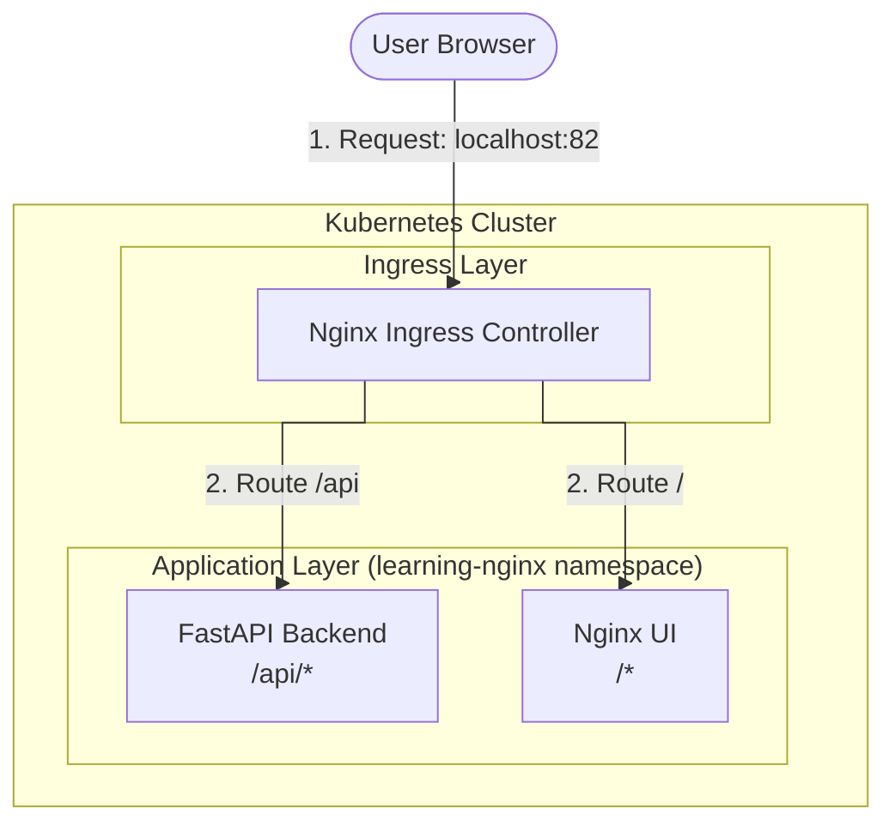

# Nginx Ingress Simple Implementation

This setup uses the standard **Nginx Ingress Controller** to route traffic to the UI and API.

## Architecture


- **Namespace**: `learning-nginx`
- **Ingress Controller**: Listens on port **82** (to avoid conflicts with other labs).
- **Hostname**: `localhost` (No `/etc/hosts` changes required).

## Setup Instructions

### 1. Run Setup
Run the setup script from this directory:

```bash
./up.sh
```

The script will:
1. Install the Nginx Ingress Controller.
2. Patch the controller to listen on port **82**.
3. Build the Docker images for the API and UI.
4. Apply the Kubernetes manifests in the `learning-nginx` namespace.

### 2. Access the Application
- **UI**: [http://localhost:82](http://localhost:82)
- **API**: [http://localhost:82/api/users](http://localhost:82/api/users)

## Cleanup
To remove the application resources:
```bash
./down.sh
```
